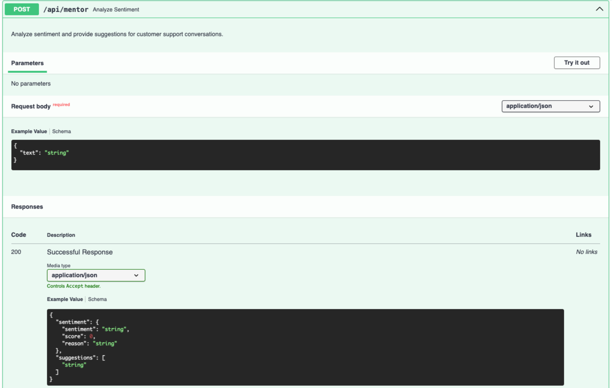
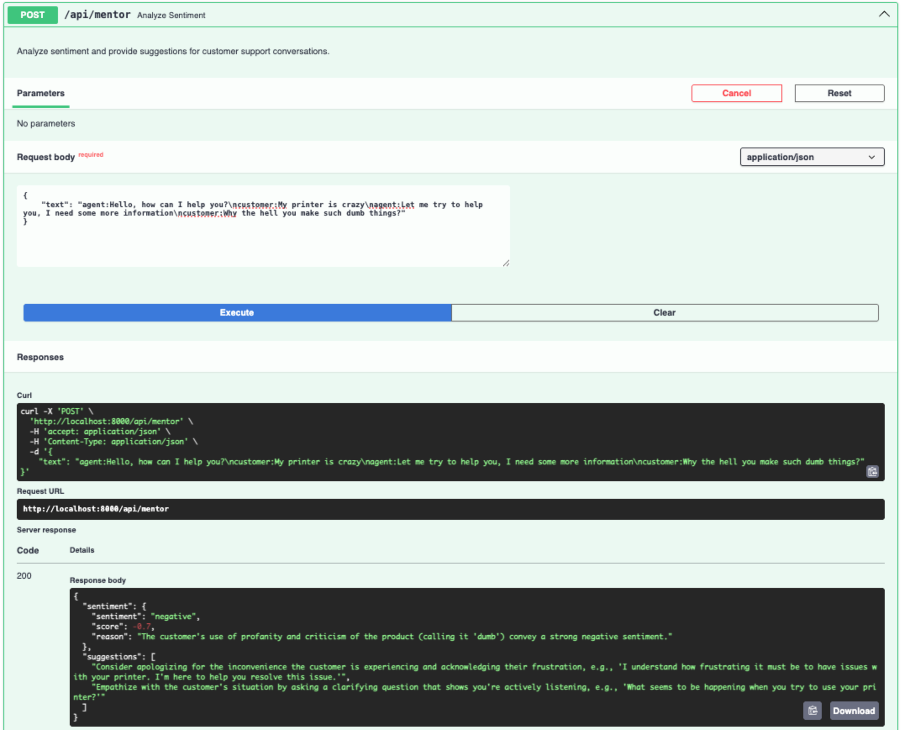

# AI based conversation mentor

This application serves as AI based mentor for making conversations positive
1. Takes conversation between customer and support agent as an input
2. Sends the conversation to LLM as context
3. LLM analyzes the conversation and determines the sentiment
4. If the conversation is turning negative, LLM sends suggestions to make conversation positive 

## Screenshots





## Prerequisites

- Python 3.12+
- [Ollama](https://ollama.com/) installed and running locally


## Installation

1. Clone this repository
2. Install the required packages:
```
pip install -r requirements.txt
```
3. Set up environment variables (optional, defaults are set in the code):
```
OLLAMA_BASE_URL = os.getenv("OLLAMA_BASE_URL", "http://localhost:11434")
MODEL_NAME = os.getenv("MODEL_NAME", "llama3")
SENTIMENT_THRESHOLD = float(os.getenv("SENTIMENT_THRESHOLD", -0.2))
```

## Required Ollama Models

Ensure you have the necessary models pulled in Ollama:
```
ollama pull llama3
```

## Running the Application

1. Ensure Ollama is running:
```
ollama serve
```

2. Initialize the system with sample documents:
```
uvicorn main:app --reload
```

3. APIs can be browsed at: http://localhost:8000/docs

    Run POST `/api/mentor` endpoint, pass conversation between agent and customer in `text` field separated byt new lines.

    In response API sends back conversation sentiment analysis along with suggestions to make it positive if the conversation is detected as negative in sentiment.

    Refer screenshots to see example
